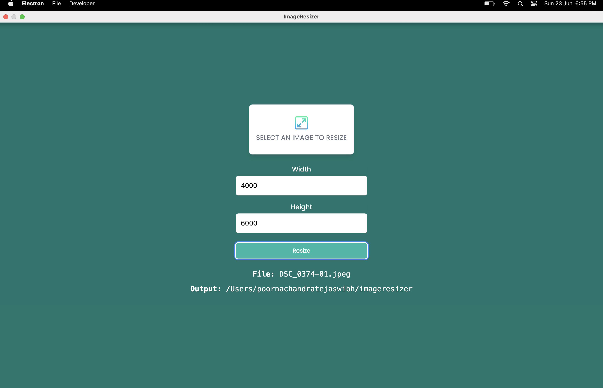

# Image Resizer Electron App

Electron application that allows you to select an image and easily change the width and/or height.

<div style="display: flex; justify-content: center">

</div>

## Table of Contents
- [Installation](#installation)
- [Usage](#usage)
- [End-to-End Testing with WebdriverIO](#end-to-end-testing-with-webdriverio)
- [Unit Testing with Mocha](#unit-testing-with-mocha)
- [Screenshots](#screenshots)
- [License](#license)

## Installation

To get started with the project, clone the repository and install the dependencies:

```bash
git clone https://github.com/your-username/image-resizer-electron.git
cd image-resizer-electron

npm install
npm install -g electronmon
```

## Usage

Install dependencies:

```bash
npm install
```

Run:

```bash
npm start
```

You can also use `Electronmon` to constantly run and not have to reload after making changes

```bash
npx electronmon .
```


## End-to-End Testing with WebdriverIO

We have implemented end-to-end (E2E) tests using WebdriverIO to ensure the critical functionalities of the app are working as expected.

Setting Up WDIO
Install WDIO and necessary dependencies:

```bash
npm install @wdio/cli @wdio/local-runner @wdio/mocha-framework @wdio/spec-reporter webdriverio @wdio/selenium-standalone-service
Initialize WDIO:


npx wdio config
Configure the settings as follows:

Runner: local
Framework: mocha
Reporters: spec
Services: selenium-standalone
Base URL: http://localhost
Create a WDIO configuration file wdio.conf.js.

Create E2E test files under test/specs/.

Start the Electron app:

npm start
In another terminal, run the WDIO tests:


npx wdio wdio.conf.js
```

## Unit Testing with Mocha

We have implemented unit tests using Mocha to ensure the core components of the app are functioning correctly.

Setting Up Mocha
Install Mocha and Chai:

```bash
npm install mocha chai
Create unit test files under test/unit/.

Run the unit tests:

npx mocha test/unit/**/*.js
```

## Screenshots

### Application Running : 


### Unit Test Results :


### Application Screenshots :


## License

This project is licensed under the MIT License.

### Manual Testing Results :

Go to link below and open file for results 

Macbook users :

https://drive.google.com/file/d/1x4YXCXsb3CnT8bg-KDiuPmqXJhKGhdXG/view?usp=drivesdk

xlsx file :

https://docs.google.com/file/d/1HL5htupesnd6PEsF0FV2BoP7dZ2jkRvm/edit?usp=docslist_api&filetype=msexcel


## Developer Mode

If your `NODE_ENV` is set to `development` then you will have the dev tools enabled and available in the menu bar. It will also open them by default.

When set to `production`, the dev tools will not be available.
